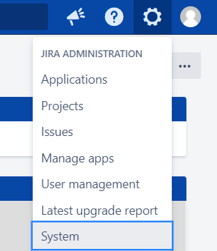
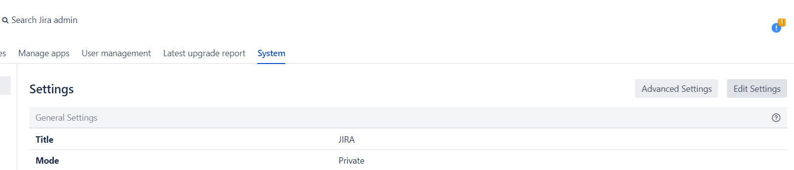
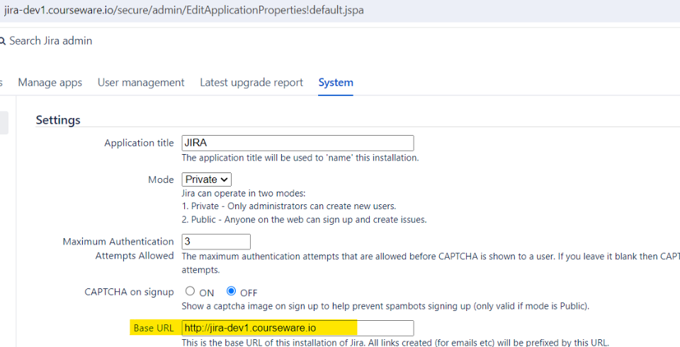
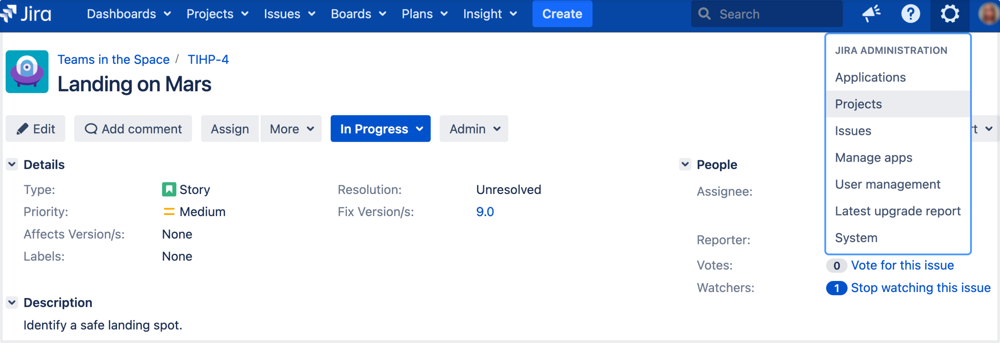

## Lab: Creating a project

A Jira project is a container that holds issues. Issues can be viewed as the packets of work required within a project. To create issues, you must have an available project to contain them. Jira comes with several default project types with preconfigured workflows and issue types, so you can quickly get your project up and running. In this step of the tutorial, you will use the project management template to help your team plan, organize, and collaborate on their work.

Note that creating and configuring a project is done by an administrator. A project administrator controls user access to the project, and can only configure certain aspects of the look and feel of the project. You should still be logged in to Jira as an administrator. If not, log into your administrator account. 

#### Modifying Jira base URL

For all of the following procedures, you must be logged in as a user with the Jira system administrator global permissions.

To configure the base URL:

1.In the upper-right corner of the screen, select **Administration**  > **System**.

2. In the sidebar, select **General configuration**.

3. Select **Edit settings**.

4. Enter the new URL in the **Base URL** text box.

**Note:** Use the base URL same as your lab environment URL. For example: `http://UPDATE_HERE.courseware.io`

5. Select **Update** to save your changes.

#### Create a project 

When creating a project, yo need to give it a name, a key, and add a project lead. The name can be as descriptive as you want, and the key should be something meaningful. The project lead is usually the project manager, but can effectively be any user you select when creating the project.  

1. Select **Projects** > **Create project**, and then configure a new project.
2. Select **Project management** as the project type.
3. Enter **Dragon Design Tees** as the project name. Note that Jira creates a Project key for you, but you can overwrite this if you want to. 
4. Select **Submit** to create your new project.

If you don’t follow the Getting started as an administrator tutorial, go to the main header, 

**About project keys**

Each project has a unique name (e.g. Dragon Design Tees) and a unique key (e.g. DDT). The project key becomes the first part of that project's issue keys, e.g. DDT-1, DDT-2, etc.

#### Customize your project 

In this step, you will be customizing your project avatar and project details to help your team identify the project more easily. These customizations are helpful if you have several projects in your Jira instance. If you have navigated away from your project, simply go to Projects > Dragon Design Tees.

1. In the upper-right corner of the screen, select **Administration**  > **Projects**.

2. Select **Edit** next to your project.
3. Click the **Avatar** image.
4. Select an available icon or upload an image.
5. Enter a URL and Description for your project to make it easier for your team to identify. Note that these fields are optional and only for display.
6. Select **Save details** to save your changes.

Congratulations! You've now created and customized your first project. Next, we'll add users to your project and look at how you can set up and restrict access to projects. 