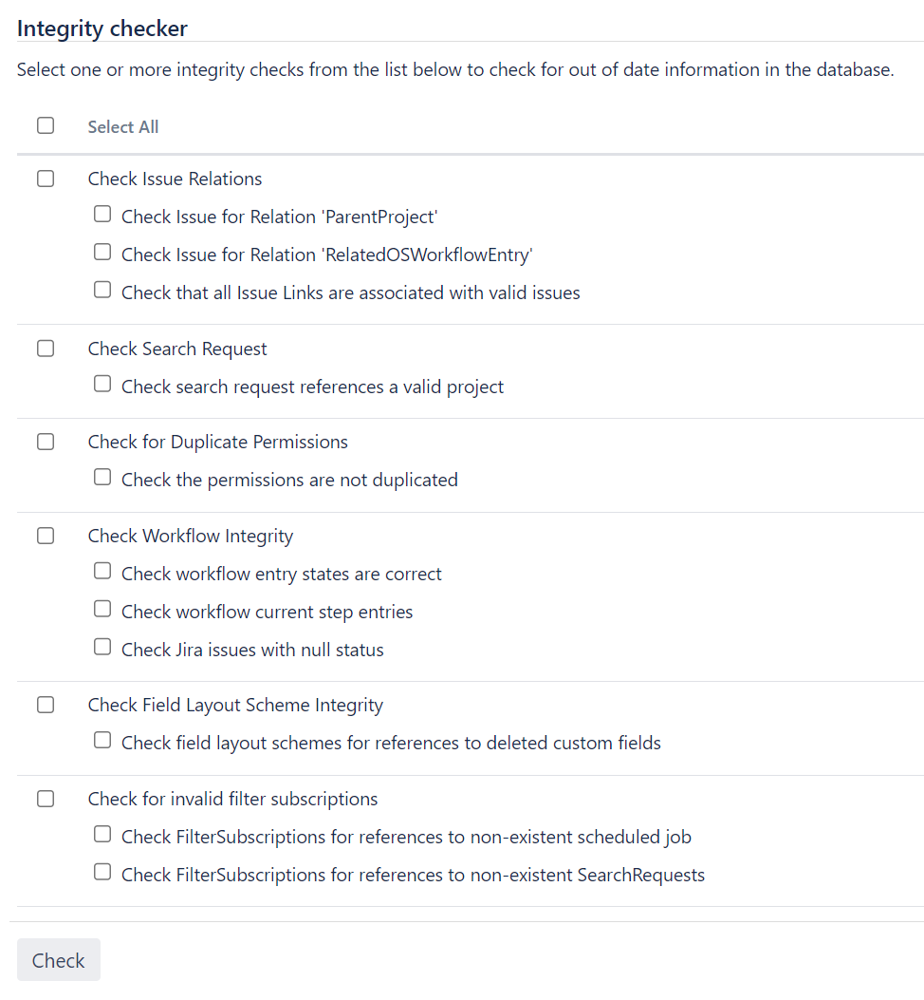

## Lab: Using the database integrity checker

Searching for common data inconsistencies, the Database Integrity Checker attempts to ensure that all Jira data is in a consistent state.

This is useful in a number of situations, for example:

- Before migrating a project to a new workflow
- An external program is modifying Jira's database
- Troubleshooting a server crash

If an error is encountered, most of the integrity checks provide a 'repair' option that attempts to reset the data to a stable state.

For all of the following procedures, you must be logged in as a user with the Jira system administrator global permissions.

#### Using the Integrity Checker

1. From the top navigation bar select **Administration** > **System**. 

2. Select **System support** > **Integrity checker** to open the **Integrity checker** page.
The integrity checker has a number of integrity checks that look for common inconsistencies in Jira's stored data.

3. Select one or more options you would like to run and select the **Check** button.

4. While the checks are running, you can track the status of the operation in the progress bar. When the operation is complete, select the **Acknowledge** button.

5. The preview screen will display to show you if all the checks have passed.

    - If any data inconsistencies are found, they'll display in red and the **Fix** button will also appear on the page. To fix the incosistencies, select the check for which they appear and select the **Fix** button.
    - Messages in yellow are warnings that the check won't correct. Jira will auto-recover from these inconsistencies when an action is taken on an issue.

6. If any inconsistencies were found and you chose to correct them, you will be presented with a summary screen describing all the corrective actions that have taken place.