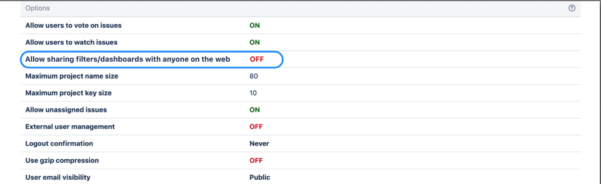
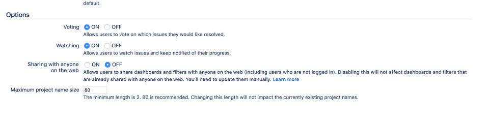

## Lab: Control anonymous user access

You can configure Jira to restrict anonymous user access and protect your data from being viewed by users that aren't logged-in. Oftentimes, anonymous users can access your data if you have filters or dashboards set to be viewed publicly or you have the Browse users global permission granted to the Anyone group. Shared publicly and Anyone in these cases mean anyone from **in and outside your organisation**.

Proper configuration can:

- prevent Jira filters, dashboards, project and user information from being shared unintentionally with the public by their owners (e.g.- - Anonymous users able to see shared filters dashboards or project issues)
- control content that is available to search engine crawlers.

### I want to know if my instance has public facing content

**1. Check whether pubic sharing is ON.**

In order to identify if your instance has content that is open for the public you first need to confirm if the **Sharing with anyone on the web** functionality is ON. If your Jira instance is private and not to be used by users without logging in you should **turn this feature OFF**. This way users will no longer be able to share any dashboards or filters with anonymous users.

This feature is OFF by default.

Jira administrators can disable the option of Jira users to share dashboards and filters publicly. To disable this option do the following. 

1. Go to **Administration** > **System** > **General Configuration**. 
2. Click **Edit Settings**. 
3. Select OFF in **Sharing with anyone on the web**. 
4. Click **Update**.

Turning the feature off will not affect existing filters and dashboards. If you change this setting, you will still need to update the existing filters and dashboards if they have already been shared publicly.

If you've still chosen to allow sharing with anyone on the web in some circumstances you can set the default preference for your users to private so that they can't accidentally grant public access to dashboards or filters.

To set the default sharing for filters and dashboards:

1. Go to **Administration** > **System**.
2. Choose **Default user preferences** and select **Edit default values**.
3. Set `Default access` to Private and click **Update**.

**2. Get the list of existing public filters and dashboards.**

Even if you've disabled sharing with anyone on the web, this does not update existing filters and dashboards. To confirm if there are any filters or dashboards shared with the public we can run the SQL queries below.

#### Filters

Get the list of all filters of the "AShare with anyone on the web" share type (i.e. global). Go to **Administration** > **System** > **Shared Items** > **Shared filters** and look for any filters with the **Shared with anyone** on the web status in the Shared with column.

**Note:** You will get empty filter list if you don't have any filter created.

#### Dashboards

Get the list of dashboards of the "share with everyone" share type (i.e. global). Go to **Administration** > **System** > **Shared Items** > **Shared dashboards** and look for any dashboards with the **Shared with anyone on the web** status in the **Shared with** column.

**3. Monitor the Browse User global permission**

Through the user picker functionality within Jira your user base information could be available to anonymous users. The Browse User Global Permission allows a user to view a list of all Jira user names and group names, share issues, and @mention people on issues. This is used for selecting users/groups in popup screens and also enables auto-completion of user names in most 'User Picker' menus and popups.

If you grant this permission to the Anyone on the web group, you will be allowing anonymous users access to the endpoints that provide a list of users.

Ensure that this permission is restricted to specific groups that require it. You can restrict it in **Administration** > **System** > **Global Permissions**.

### I want to restrict all my public facing content

**1. Update your existing public filters and dashboards**

To restrict you public facing filters and dashboards, change the sharing configuration for the filters manually.

First, make sure you've turned off public sharing and identified content that is currently shared publicly.

**2. Block all anonymous access**

You can use a dark feature to disable site-wide anonymous access was introduced. For more on dark features, check How to manage dark features in Jira. 

Enable the dark feature to disable public access

1. Log in as an administrator and go to 
`[BASE-URL]/secure/SiteDarkFeatures!default.jspa`.
2. In the **Enable Dark Feature** text field, add `public.access.disabled`.