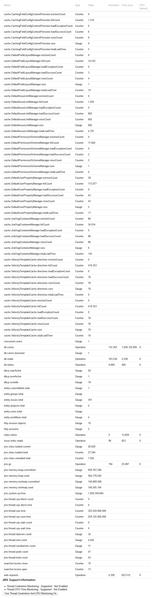

## Lab: Data collection policy & Viewing instrumentation statistics

### Data collection policy

To view a sample of data that might be collected from your specific installation:

1. Log in as a user with the Jira Administratorsglobal permission.
2. Choose **Administration** > **System** > **Advanced** > **Analytics**.
3. Select the **Sample Data** link.

**How is data collected from Data Center installations?**

Analytics are collected using the Atlassian Analytics app. The app collects analytics events in a log file which is located in the Jira home directory under the analytics-logs sub directory. The logs are periodically uploaded using an encrypted session and then deleted. If the Jira installation is unable to connect to the Internet, no logs are ever uploaded. 

**Enabling/disabling data collection in Jira Data Center**

You can switch off analytics collection at any time: 

1. Log in as a user with the Jira Administrators global permission.
2. Choose **Administration** > **System** > **Advanced** > **Analytics**.
3. Select **Disabled**, and **Save** your change.

### Viewing Jira application instrumentation statistics

Jira provides an **Instrumentation** page, which displays a variety of statistics on a wide range of internal properties within Jira that have been 'instrumented' (i.e. recorded) for presentation through Jira's administration area.

This page is mostly useful to help Atlassian Support provide assistance with your support queries, especially if they ask you to quote the statistics of one or more properties listed on this page.

**Note:** For all of the following procedures, you must be logged in as a user with the Jira Administrators global permission.

1. From the top navigation bar select **Administration** > **System**. 
2. Select **System support** > **Instrumentation** to display the Instrumentation page.

