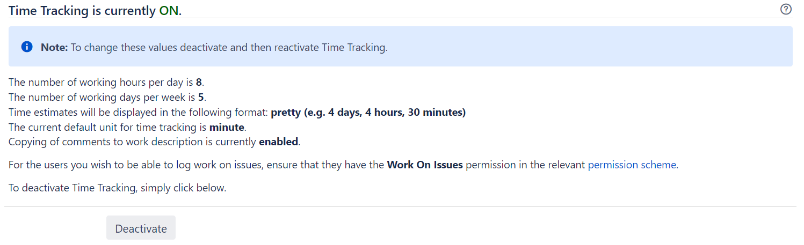
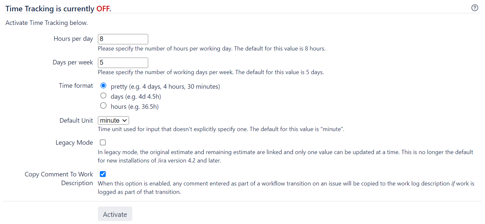
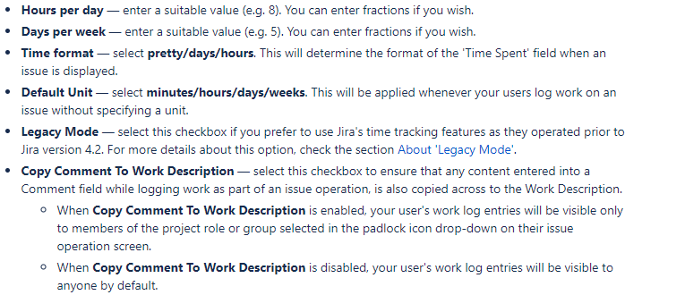

## Lab: Configuring time tracking

Jira's time tracking feature enables users to record the time they spend working on issues. 

**Note:**

- Before users can specify time estimates and log work, they must be granted the **Work On Issues** permission for the relevant project(s).
- For all of the following procedures, you must be logged in as a user with the **Jira Administrators** global permission.
- After you make any changes to the time tracking configurations, you should `reindex your Jira`.

#### Disabling time tracking

Time tracking is enabled by default. You can disable it on the Time Tracking administration page.

**Info** Time tracking will be disabled by default if your Jira installation was upgraded from a version prior to 4.2 that had time tracking either disabled or never enabled.

1. In the upper-right corner of the screen, select **Administration** > **Issues**.

2. Select **Issue Features** > **Time Tracking** to open the Time Tracking page.

3. Click the **'Deactivate'** button to turn time tracking OFF.

You will not lose any existing time tracking data by disabling and re-enabling time tracking.

#### Enabling time tracking

To enable time tracking:

1. In the upper-right corner of the screen, select **Administration** > **Issues**.

2. Select **Issue Features** > **Time Tracking** to open the **Time Tracking** page.

3. Select **Activate** to enable time tracking.

#### Configuring time tracking settings

To edit Jira's time tracking settings, it must first be disabled. Once you have changed the settings, you will then need to re-enable time tracking so that users can log work on issues.

(info) You will not lose any existing time tracking data by disabling and re-enabling time tracking.

1. In the upper-right corner of the screen, select **Administration** > **Issues**.

2. Select **Issue Features** > **Time Tracking** to open the Time Tracking page.

3. If time tracking is enabled (the page title displays "Time Tracking is currently ON"), select **Deactivate** to disable time tracking.

4. The time tracking settings will now be editable.

5. Configure time tracking settings by editing the following fields:

6. Select **Activate** button to enable time tracking.

(info) If the permission schemes used by your project already have the appropriate **Work On Issues** permissions, you don't need to proceed any further. However, if you need to configure these permissions, proceed with the following steps.

7. Select the **permission scheme** link. The **Permissions Scheme** page will display.

8. Select the **Permissions** link of the permission scheme associated with a project where you want to specify **Work On Issues** permissions. The **Edit Permissions** page is displayed for your chosen permission scheme.

9. Check whether **Work On Issues** contains the appropriate users, groups, or project roles that need to specify time estimates or log work. If it doesn't, select Edit.

10. Select users, groups, or project roles who will be able to track time and log work on issues.

11. If an original estimate must be set when an issue is created or edited, ensure that the **Time Tracking** field is added to the relevant screens associated with these operations. Refer Associating a screen with an issue operation for more details.

#### Reindexing Jira

Changes to the time tracking configurations affect Jira search index. After you make changes to any settings, you'll get the following message in the Administration view:

`We recommend that you perform a re-index, as configuration changes were made to 'SECTION' by USER at TIME. If you have other changes to make, complete them first so that you don't perform multiple re-indexes`

The message means that configuration changes have been made to Jira but haven't yet been reflected in the search index. Until Jira search index has been rebuilt, some search queries from Jira might return incorrect results. 

To avoid any discrepancies, you should rebuild Jira search index.