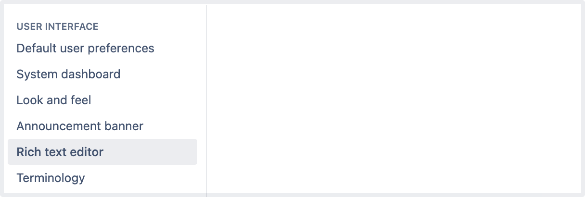
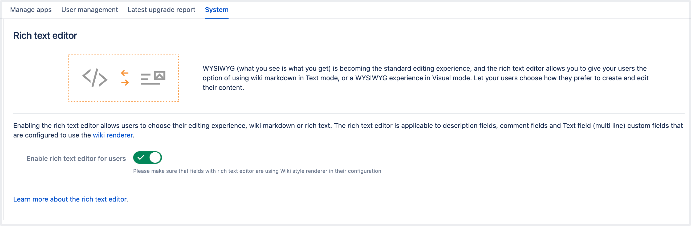
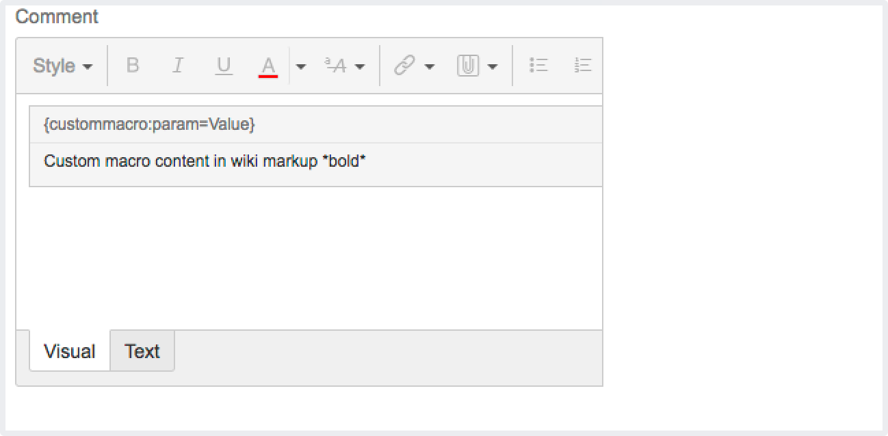
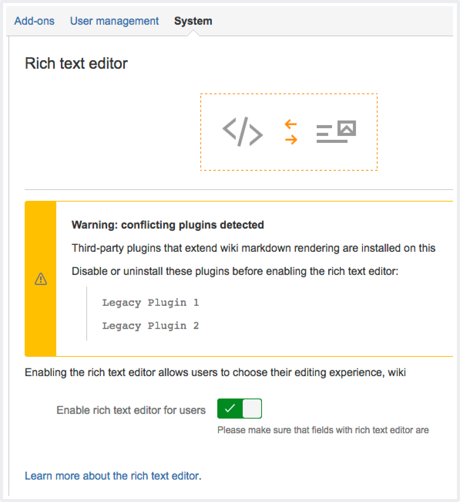

## Lab: Enabling logout confirmation & Rich text editing

### Enabling logout confirmation

Administrators can configure Jira to prompt users with a confirmation before logging them out. 

By default, Jira will not prompt users to confirm logging out. To change this:

1. From the top navigation bar select **Administration** > **System**. 

2. Select **General configuration** to open the Administration page.

3. Locate the 'Options' section.

    By default, Jira will not prompt users to confirm logging out. To change this, click the **Edit Settings** button at the top of the page, and then enable or disable logout confirmation.

    The **Never** and **Always** settings are self-explanatory. When set to **Cookie**, your Jira users will only be prompted if they have logged in using a cookie (i.e. by selecting the **'Remember my login on this computer'** checkbox before they click the 'Log In' button).

### Rich text editing

The rich text editor lets your users choose between two options:

Text mode, which supports a modified version of wiki markdown. Learn more about Jira markdown formatting syntax.
Visual mode, which is a What You See Is What You Get (WYSIWYG) editor.
The rich text editor is available on description fields, comment fields, and all Text field (multi-line) custom fields that use the wiki renderer.

**Enable or disable the rich text editor**

Rich text editing is enabled by default, but you can disable it as follows:

1. From the top navigation bar select **Administration** > **System**. 

2. Go to the **User Interface** section (in the left-side menu) and select **Rich text editor**. 

Select the **Enable rich text editing for users** toggle to enable or disable the editor. 

Currently, the editor doesn't support:

- nested tables
- pasting rich text (plain text is fine) that contains complex formatting

Third-party macros provided by apps that aren't compatible with  Jira 9.14 are displayed in legacy mode:

The Macro header is not editable in Visual mode, and content within the macro is presented in text mode (wiki markup).

You can check the status of your apps on the **Rich text editor** configuration page:

