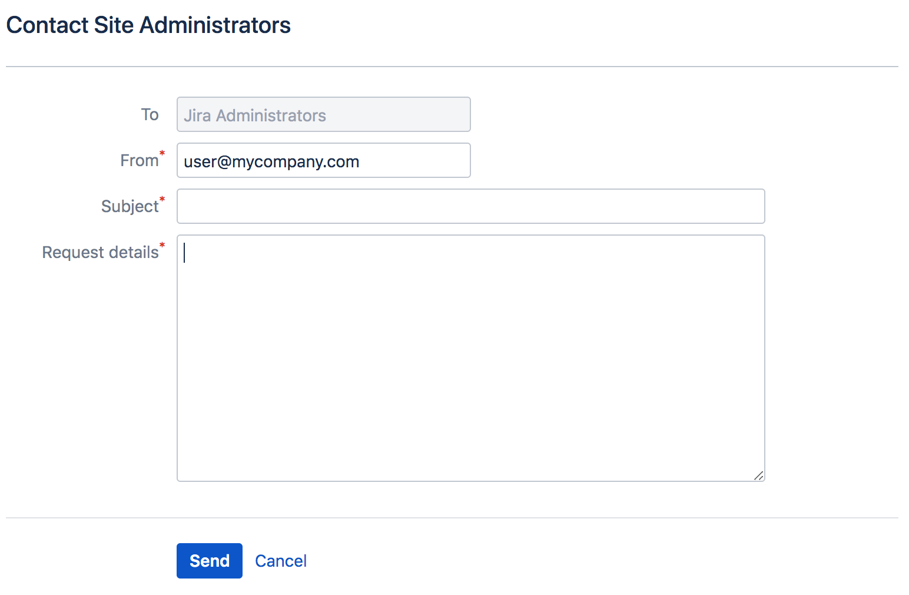

## Lab: Configuring advanced settings & Administrator contact form

### Configuring advanced settings

Jira has a small number of commonly edited advanced configuration options, which are stored in the Jira database. These options can be accessed and edited from the Advanced Settings page. You must be a Jira System Administrator to do this.

**Editing Jira's advanced settings**

To access and edit options on the **'Advanced Settings'** page:

1. From the top navigation bar select **Administration**  > **System**. 
2. Click the **Advanced Settings** button on the 'General Configuration' page.
3. Edit the value of a **Key** by clicking its value on the right of the page and modifying the existing value.

### Configuring the administrator contact form

The administrator contact form allows a user to send a message to the administrators of their Jira site by clicking the 'Contact Administrators' link. For example, the link appears on Login panels and pages.

**Customizing the administrator contact message**

You can customize the message that is presented to the user on the **'Contact Administrators Form'**. 

To edit the administrator contact message:

1. Choose the **Administration** > **System** .

2. Choose **General Configuration**.

3. Click **Edit Settings**.

4. Scroll down to the **Contact Administrators Form** and set it to ON.

**NOTE:** You will need to configure a mail server first to enable this feature. If you don't have email server, you can skip these steps.

5. Enter your text in the **Contact Administrators Message** box. If you need markup assistance, click the `?` under the box. 

6. Click **Update**.

If users send a message with the contact form it will reach all admins in the Jira admin group.

**The Default Administrator Contact Message**

By default, the contact administrators message looks the following:

To restore the message to its default simply remove the custom message you entered  so that the  Contact Administrators Message field is empty.

**Disabling the Contact Administrators Form**

To enable or disable the administrator contact form:

1. Choose the  **Administration** >  **System**.
2. Choose **General Configuration**.
3. Click **Edit Settings**.
4. Scroll down to the **Contact Administrators Form** and set it to OFF.
5. Click **Update**.