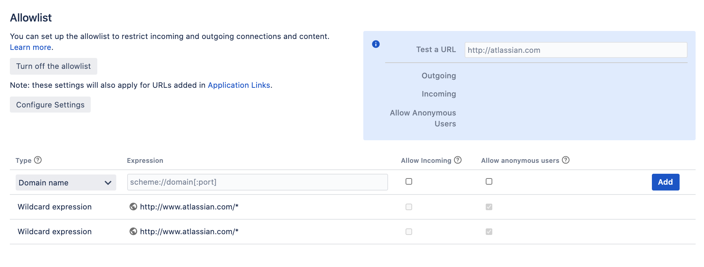
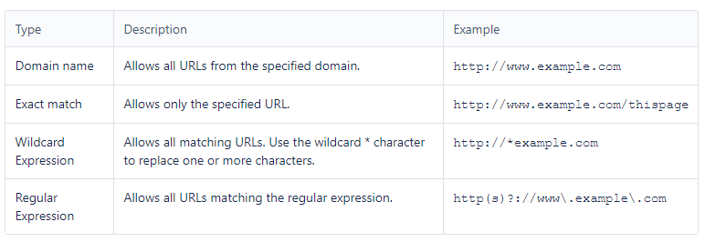

## Lab: Configuring the allowlist

Jira admins can allow incoming and outgoing connections and content from specified sources by adding URLs to the allowlist. Jira will display en error if content has been added that is not from an allowed source, and prompt the user to add the URL to the allowlist.

For all of the following procedures, you must be logged in as a user with the Jira Administrators global permission.

**Add allowed URLs to the allowlist**

To add URLs to the allowlist:

1. From the top navigation bar select **Administration** > **System**. 
2. Select **Allowlist**.

3. Enter the URL or expression you want to allow.
4. Choose the **Type** of expression (see Expression Types below for examples).
5. Choose **Allow Incoming** if you need to allow CORS requests.
6. Choose **Allow anonymous users** if you need to allow unauthenticated users.
7. Choose **Add**. Your URL or expression appears in the allowlist.

To test that your allowlisted URL is working as expected, you can enter a URL in the **Test a URL** field. Icons will indicate whether incoming or outgoing traffic is allowed for that URL.

**Expression types**

When adding a URL to the allowlist, you can choose from a number of expression types. 

**Allow incoming**

**Allow Incoming** enables CORS requests from the specified origin. The URL must match the format `scheme://host[:port]`, with no trailing slashes (`:port` is optional). So `http://example.com/` would not allow CORS requests from the domain `example.com`.

**Allow anonymous users**

You can use the **Allow anonymous users** option to allow outbound requests on behalf of unauthenticated users.

This isn't recommended for URLs that may contain private data, such as URLs from application links. If you do need to provide anonymous access, consider using an exact URL or wildcard based rule to limit access to just the required resources.

**Change default settings for new application links**

When you create an application link, the URL is automatically added to the Jira allowlist. By default, outbound requests from these URLs are only allowed for authenticated users.

To change the default behavior for all application links:

1. From the top navigation bar select **Administration** > **System**. 
2. Select **Allowlist**.
3. Select **Configure Settings**.
4. Select either:
    - **Allow all users** to allow outbound requests for all users, including anonymous users
    - **Allow authenticated users** to deny outbound requests for anonymous users
    - **Restrict** by default to deny outbound requests for all users (application link won't be added to the allowlist)
5. **Save** your changes.

All application links, including new application links added to the allowlist, will use this setting. 

**Disable the allowlist**

To disable the allowlist:

The allowlist is enabled by default. You can choose to disable it, but this will allow all URLs, including malicious content, and is not recommended. 

1. From the top navigation bar select **Administration** > **System**. 
2. Select **Security** > **Allowlist**.
3. Click the **Turn off** allowlist button.
4. Choose **Confirm**. 

All URLs will now be allowed. Unless your instance is running in an environment without internet access, we do not recommend disabling the allowlist.