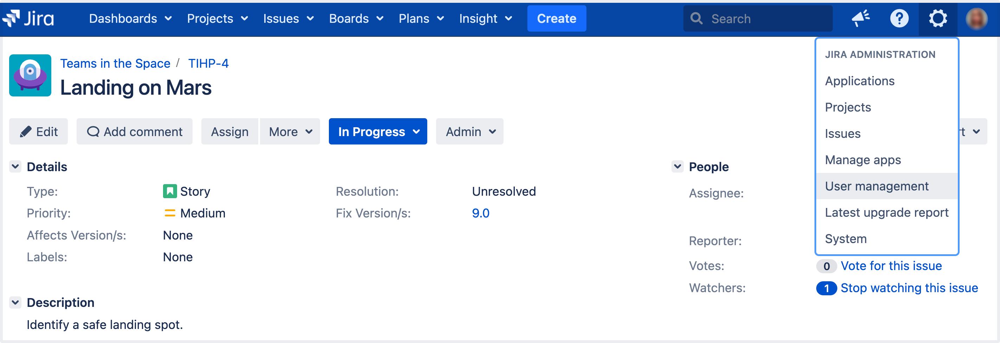
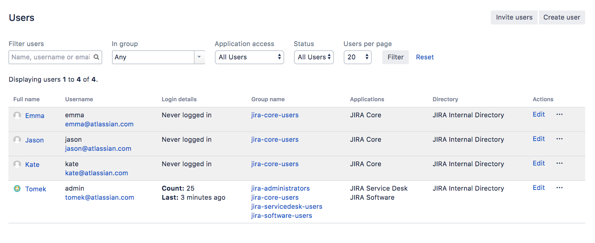

## Lab: Adding new users

Working alone isn't much fun, so let's add some test users to your Jira site. You can add users directly, or allow new users to sign up themselves. In this step in the tutorial, you'll add three users directly to your site. 

**Add a few users**

You will be adding three users: **Jason, Kate and Emma**. You can add more or choose your own usernames if you like, but note that we will be referring to these usernames later in the tutorial. You can always disable or delete any users you set up.

If you've logged out of Jira, log in with the administrator account you created.

1. In the upper-right corner of the screen, select **Administration** > **User Management**.

2. Select **Create User** to add a new user. Specify the username as **jason**. Set the rest of the fields to whatever you want. You're going to be creating a couple more users, so check the **Create another** check box before selecting **Create user**.

3. Now create two more users, with the usernames **emma** and **kate**, following the same process outlined above.

You should have a screen that looks something like this:

Usernames are **not** case sensitive. Emma can enter her username as Emma, emma, or even EmMA to log into Jira. Passwords, on the other hand, are case sensitive.

Well done! You've added three new users to your Jira instance. Next, you'll learn how to manage access to your project with site and project permissions. 

