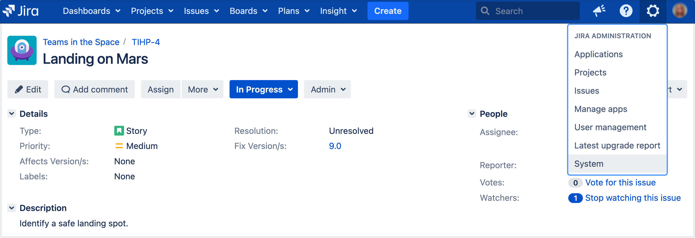

## Lab: Managing permissions

You won't want every user in your team to have the same level of access to Jira. For example, you may want to restrict who can administer Jira, or prevent users from viewing a project. In this step, you will learn about the different permissions in Jira and set permissions for a new project.

#### Overview of roles, groups, and users

A role is a project-specific set of groups and/or individual users. In our example of the design project in the t-shirt business, all product managers need to be able to assign work (issues) across all projects, while senior designers need to be able to assign work on specific design projects. In Jira, you can define a product manager role that includes all product managers. You can then define a set of permissions with the **Assign issue** permission for this role, and apply this set of permissions to all projects. Individual senior designers can be added to the product manager role on each project, as needed.

#### Overview of global and project permissions

Global permissions cover a small set of functions that affect all projects in Jira (for example, permission to administer Jira). They can only be assigned to groups: 

Project permissions cover a set of more granular functions that affect a single project in Jira. For example, permission to create issues in a project. They can be assigned to groups, users and project-specific roles:

Now let's put this into practice! You're going to go through the tasks involved to use project permissions to hide a new, secret t-shirt design project from some of your users.

### Create a new project role

This project role will only contain users that you want to view a particular project. We will assign permissions to this role in the next step.

1. In the upper-right corner of the screen, select **Administration**  > **System**.

2. On the left-side navigation panel, in the **Security** section, select **Project roles**.

3. Below the existing project roles, add another project role named "Review". Leave the Description field blank for now and select **Add project role**.

4. Select **Manage Default Members** and then, under Default Users, select **Edit** to add yourself and **Jason** to the Review project role. Do not add Kate or Emma.

**Configure a new permission scheme**

The **Browse Projects** permission controls whether a user can browse a project, i.e. whether they can view the project. Let's assign this permission to your new project role.

1. In the upper-right corner of the screen, select **Administration**  > **Issues**.

2. On the left-side navigation panel, in the **Issue security schemes** section, select **Permission Schemes**. 

3. Copy the **Default Permission Scheme**.

4. Edit the copied permission scheme and change the name to **Confidential Permission Scheme**. Select **Update**.

5. Select **Permissions** for the **Confidential Permission Scheme**. For the Browse Projects permission:
    - Select **Remove** for "Application Role (Any logged in user)".
    - Select **Edit**, select **Project Role**, and choose **Review** in the dropdown. Select **Grant**.

**Associate the scheme with a new project**

For the last step, let's associate the permission scheme with your new project. 

1. Select **Projects** > **Create Project** and choose **Task management**.

2. Name the project **Top Secret Tee** and **Submit**.

3. In the bottom-left corner, select **Project settings** > **Permissions**.

4. On the Default Permission Scheme screen, select **Actions** > **Use a different scheme**.   

5. Set the Scheme to **Confidential Permission Scheme**, and select **Associate**.

The only users that will be able to browse your new project are Jason and yourself. Note that default members are only added to a role for new projects. You can also use this approach to restrict users from creating issues, adding comments, closing issues, etc, in a project.

