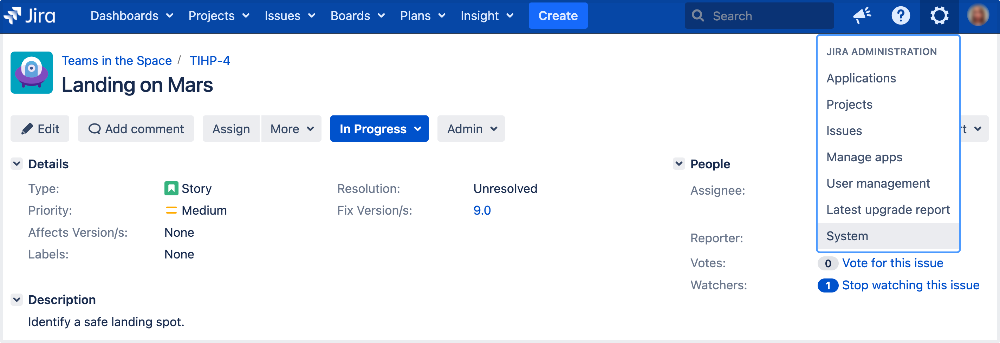
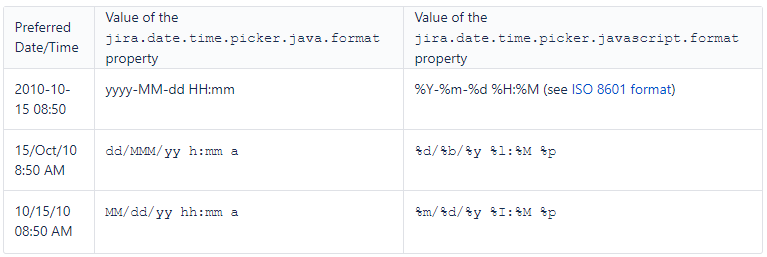

## Lab: Configuring the look and feel of your Jira applications

As a Jira administrator, you can customize the look and feel of your Jira applications to match your company's environment. This page will walk you through the following: 

**How to change your logo**

The logo appears in the top left corner of every Jira application page. The height of the logo image must be constrained to 30 pixels. We also recommend you use an image with a width of 57 pixels.

1. In the upper-right corner of the screen, select **Administration**  > **System**.

2. Under **User interface** (the left-side panel), select **Look and feel**.

3. In the Logo section, upload the image for the logo you want to use in your Jira application. 

**How to show your site title**

If enabled, your site name will appear next to your logo.

1. In the upper-right corner of the screen, select **Administration** > **System**.
2. Under **User interface** (the left-side panel), select **Look and feel**.
3. Select the **Show Site Title** checkbox to make your instance name appear next to your logo in the header.

**How to change the favicon**

The favicon appears typically to the left of your browser's URL field, and on browser tabs displaying a page on your Jira site. To upload a favicon, make sure it's in PNG format, with dimensions of 32x32 pixels, 71x71 DPI, and with 8-bit color depth.

1. In the upper-right corner of the screen, select **Administration** > **System**.
2. Under **User interface** (the left-side panel), select **Look and feel**.
3. In the Favicon section, upload the image for the favicon in your Jira application or upload from a URL beginning with 'http://' or 'https://'.

**How to change Jira application colors**

You can use color options to control the appearance of the entire Jira user interface. The colors you choose for each option can be anything that is valid for both a font tag, and a stylesheet's 'color' attribute.

1. In the upper-right corner of the screen, select **Administration**  > **System**.
2. Under **User interface** (the left-side panel), select **Look and feel**.
3. In the Colors section, modify the color schemes for the different elements of your Jira instance as needed using the pop-up color chooser, or by specifying your own (eg. '#FFFFFF', 'red'). 
4. To return to the original color scheme, just clear any values that you've set, or click **Revert** in the row where you made the change.

**How to change the gadget colors**

You can use any of the color options to change the color of a gadget's frame on the Jira dashboard. 

1. In the upper-right corner of the screen, select **Administration** > **System**.
2. Under **User interface** (the left-side panel), select **Look and feel**.
3. In the Gadget Colors section, select the color option for the gadget's frame on your Jira dashboard, and then modify the color as needed using he pop-up color chooser, or by specifying your own (eg. '#FFFFFF', 'red').
4. To return to the original color scheme, just clear any values that you've set, or select **Revert** in the row where you made the change.

Color 1 is the default frame color for newly-added gadgets. The colors you specify for each of the options can be anything that is valid for both a font tag, and a stylesheet's 'color' attribute.

**How to change date and time formats**

You customize the way times and dates are presented to users throughout the Jira user interface. When specifying dates and times, they should be based on the Java SimpleDateFormat.

1. In the upper-right corner of the screen, select **Administration** > **System**.
2. Under **User interface** (the left-side panel), select **Look and feel**.
3. In the Date/Time Formats section, click the value of the element you want to configure, then update the value as necessary.

Issue date/time fields show a relative instead of absolute date/time format. For example, "Yesterday" would appear instead of "20 May 2013 12:00 PM". You can still see the absolute date/time by hovering over the field. The date/time format reverts to absolute after a week.

Here are some further examples of US date/time configurations: 

