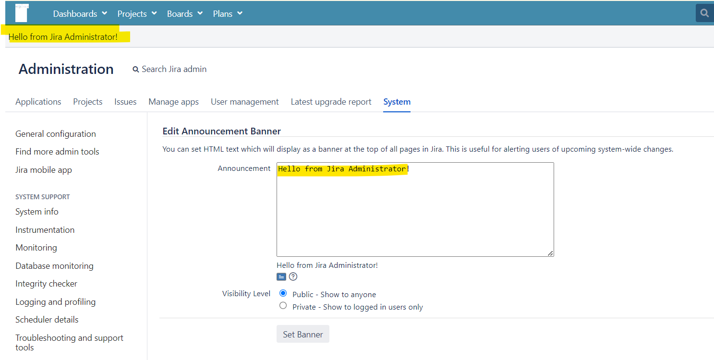

## Lab: Configuring an announcement banner

System Administrators can configure an announcement banner to display pertinent information on all Jira pages. The banner can be used to relate important information (e.g. scheduled server maintenance, approaching project deadlines, etc.) to all users. Further, the banner visibility level can be configured to display to all users or just logged-in users.

If you're using Jira Data Center, the banner can be configured to contain HTML text.

For all of the following procedures, you must be logged in as a user with the Jira System Administrators global permission.

#### Configuring an announcement banner

1. In the upper-right corner of the screen, select **Administration** > **System**.
2. Under **User interface** (the left-side panel), select **Announcement banner**.
3. Enter the required text in the **Announcement** field.
4. Select the required **Visibility level** for the banner.
5. Select the **Set banner** button.

Depending on the visibility level selected, the banner will become visible throughout Jira.

#### Banner visibility mode

The announcement banner visibility level can be configured to specify to whom the banner will be displayed. There are two modes:

- **Public** — the banner is visible to everyone
- **Private** — the banner is visible to logged-in users **only**.

