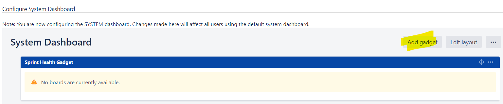

## Lab: Configuring the default dashboard

The default dashboard is the screen that all Jira users see the first time they log in. Any users who have not added any dashboard pages as favorites also see the default dashboard.

Jira allows Administrators to configure the default dashboard. The gadgets on the default dashboard can be re-ordered, switched between the left and right columns, additional gadgets can be added, and some gadgets can be configured. The layout of the dashboard (e.g. number of columns) can also be configured.

All changes made to the default dashboard will also change the dashboards of all users currently using the default. However, gadgets that users do not have permissions to see will not be displayed to them. For example, the 'Administration' gadget, although it may exist in the default dashboard configuration, will not be visible to non-admin users.Gadgets are the information boxes on the dashboard. Jira comes pre-configured with a set of standard dashboard gadgets.

For all of the following procedures, you must be logged in as a user with the Jira administrators global permission.

#### Adding and configuring gadgets on the default dashboard

Jira's default dashboard is limited to only one dashboard page. However, users can add multiple pages to their own dashboards if they wish.

1. In the upper-right corner of the screen, select **Administration** > **System**.

2. Under **User Interface** (the left-side panel), select **System dashboard** to open the Configure System Dashboard page.

3. On the Configure System Dashboard page, you can do the following:
    - Move a gadget by drag-and-drop.
    - Re-configure existing gadgets.
    - Choose a different layout.

**Pre-installed gadgets**

Jira provides a set of standard gadgets out-of-the-box. Click `Add gadget` button inside **System dashboard** page.

Click `Load all gadgets` to load all the gadgets:

