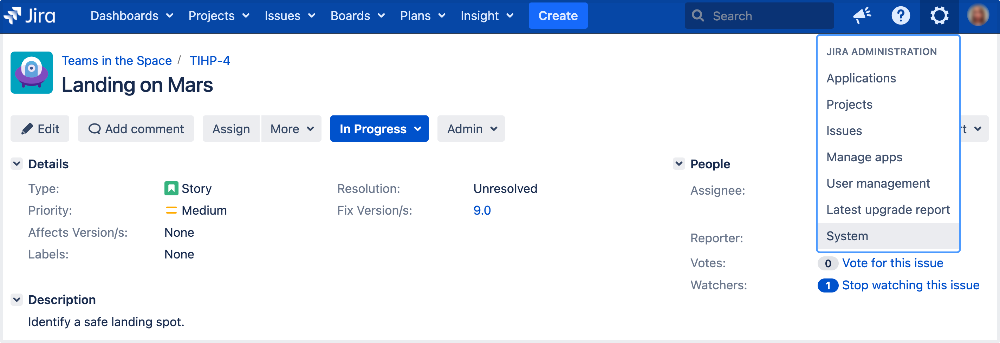
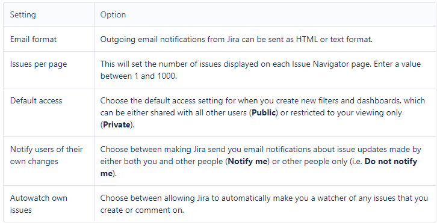

## Lab: Configuring the user default settings

Administrators can change the default user settings which are applied to user accounts on creation. These settings can be changed by the user on an individual basis through their profile.

An administrator can force the user to use a specific Email format by selecting the **Apply** link. The user will then be unable to edit this setting.

#### Changing the user default settings

1. Log in as a user with the Jira Administrators global permission.

2. In the upper-right corner of the screen, select **Administration** > **System**.

3. Under **User interface** (the self-side panel), select **Default user preferences** to open the User default settings page.

4. Select the **Edit default values** button. The User Default Settings window displays.

5. Make the changes you wish to apply. A summary of the available changes is listed below.

6. Select the **Update** button. Your changes have been applied.

The first time you access the User Default Settings window, the Email format is set to text. This will be applied if you select **Update**. Ensure you have selected the correct Email format you wish to apply.