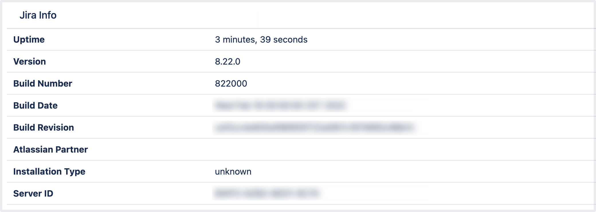

## Lab: Finding your Server ID

The **Server ID** is an identifier for your Jira instance. When creating a Jira license on my.atlassian.com, you may be prompted to enter the Server ID. You can locate your Server ID on the **System info** page.

For all of the following procedures, you must be logged in as a user with the Jira system administrator global permissions.

1. From the top navigation bar select **Administration** > **System**. 
 

2. Under the **System support** (the left-side panel), select **System info**. The **Server ID** is displayed in the **Jira Info** section of the page.

Only admins with global permissions can access **System info**. If you don't see this section, ask your Jira admins to grant you access or check the Server ID. 

